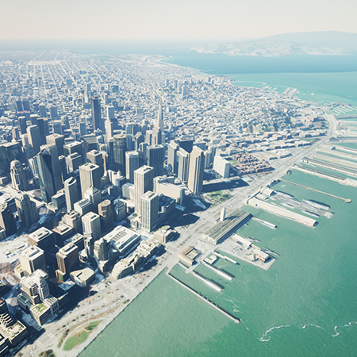

# arcgis-maps-sdk-unreal-engine-samples

Here is a Unreal Engine 5 project containing a set of samples showing you how to accomplish various things using the combined features of Unreal Engine 5 and the ArcGIS Maps SDK for Unreal Engine.

## Features
* [Line of sight](https://github.com/ArcGIS/arcgis-maps-sdk-unreal-engine-samples/tree/main/sample_project/Content/SampleViewer/Samples/LineOfSight) - See how to check line of sight between two object in Unreal Engine.
* [Third Person Character Controller](https://github.com/ArcGIS/arcgis-maps-sdk-unreal-engine-samples/tree/main/sample_project/Content/SampleViewer/Samples/ThirdPersonCharacter) - See how to run around a virtual city in Unreal Engine.

## Instructions

1. Clone this repo. **Note** On Windows there is a 260 character limit in your file path. The ArcGISMapsSDK for Unreal Engine Plugin is ~160 characters at the longest point. This samples repo by default adds `arcgis-maps-sdk-unreal-engine-samples\sample_project` for a total of ~215 characters. You can use `git clone <git_repo_url> <your_custom_directory_name>` to remove the lengthy `arcgis-maps-sdk-unreal-engine-samples` to give you more freedom for where it can be cloned.
2. Refer to the [ArcGIS Maps SDK for Unreal Engine's documentation on getting started](https://developers.arcgis.com/unreal-engine/get-started/) on how to download `Unreal Engine 5` and the `ArcGIS Maps SDK for Unreal Engine`.
3. Launch the Unreal Engine project. **Note** if you are prompted that there is a version mismatch that can be ignored, but if the project needs to be re-compiled you will need to [launch it thru Visual Studio](https://docs.unrealengine.com/5.0/en-US/setting-up-visual-studio-development-environment-for-cplusplus-projects-in-unreal-engine/). 
3. Import the Plugin into this project.
4. Launch the `SampleViewer` level. You will be prompted to enter an API Key for the samples to work. To avoid entering it each time you push play you can enter it in the SampleViewer level blueprint.

## Requirements

* Refer to the [ArcGIS Maps SDK for Unreal Engine's documentation on system requirements](https://developers.arcgis.com/unreal-engine/reference/system-requirements/)

## Resources

* [ArcGIS Maps SDK for Unreal Engine's documentation](https://developers.arcgis.com/unreal-engine/)
* [Unreal Engine's documentation](https://docs.unrealengine.com/5.0/en-US/)
* [Esri Community forum](https://community.esri.com/t5/arcgis-maps-sdks-for-unreal-engine-questions/bd-p/arcgis-maps-sdks-unreal-engine-questions)

## Issues

Find a bug or want to request a new feature?  Please let us know by submitting an issue.

## Contributing

Esri welcomes contributions from anyone and everyone. Please see our [guidelines for contributing](https://github.com/esri/contributing).

## Licensing
Copyright 2022 Esri

Licensed under the Apache License, Version 2.0 (the "License");
you may not use this file except in compliance with the License.
You may obtain a copy of the License at

   http://www.apache.org/licenses/LICENSE-2.0

Unless required by applicable law or agreed to in writing, software
distributed under the License is distributed on an "AS IS" BASIS,
WITHOUT WARRANTIES OR CONDITIONS OF ANY KIND, either express or implied.
See the License for the specific language governing permissions and
limitations under the License.

A copy of the license is available in the repository's [license.txt](license.txt?raw=true) file.
