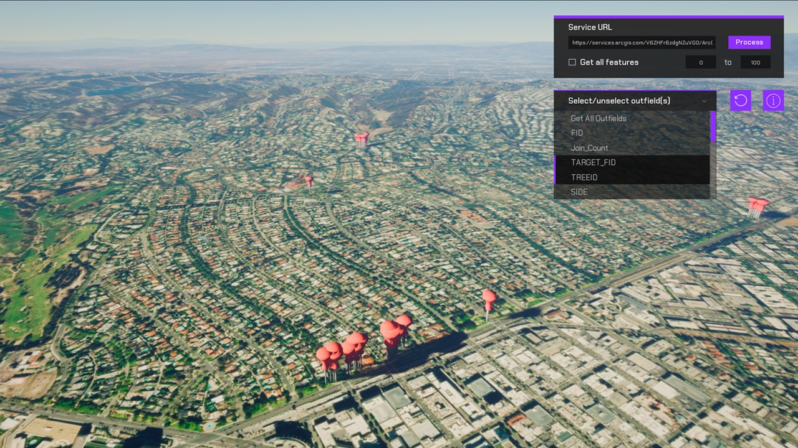

# Feature Layer

Query objects from a feature layer and show them on the map.

## How it works

1. Create an http request in the project's gamemode.cpp and gamemode.h
2. Using the UE_LOG, confirm that you are gathering the data properly.
3. Create a new Blueprint class and cast to the gamemode.
4. Using the cast, get the data stored from the http request. 
5. Spawn in a new actor of the class you created above and set the data accordingly.

## About the data

Data for all Major League Baseball Stadiums in the United States [Feature Layer](https://services.arcgis.com/P3ePLMYs2RVChkJx/ArcGIS/rest/services/Major_League_Baseball_Stadiums/FeatureServer/0/query?f=geojson&where=1=1&outfields=TEAM,NAME,LEAGUE) hosted by Esri.

Elevation data is loaded from the [Terrain 3D elevation layer](https://www.arcgis.com/home/item.html?id=7029fb60158543ad845c7e1527af11e4) hosted by Esri.

## Tags

Feature Layer, Data Collection
