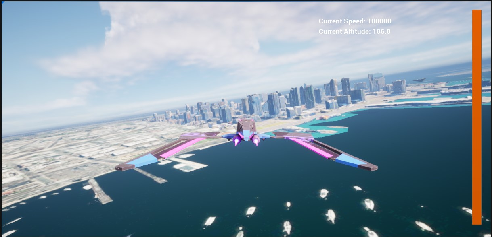

# Create a Flight Simulator Sample

Allows users to explore a city/map from the perspective of a Third Person Character.

## How it works

1. Check the box for **Mesh Colliers Enabled** on the `ArcGIS Map` component.
2. Make sure the component is in **Global Mode**.
3. Pick an airport to take off from and set the latitude and longitude of the airport as your world center
4. Create a new blueprint and call it "bp_Runway".
5. Add a cube and change the scale of it to be 50, 2500, 1. Or something similar that suits your needs.
6. Add your Plane blueprint on top of your run way.
7. Enjoy flying around the world.

Movement of the plane is done through Unreal physics.
We add a physics **linear velocity** depending on the thrust and rotate for each of the axis adding a **torque** in such axis so that the plane can rotate in the roll, pitch and yaw axes. If the plane reduces enough the speed, a false gravity drags the plane towards Earth.

## Controls
This sample supports keyboard controls and use of an Xbox/Playstation controller
Keyboard Controls: Spacebar for Acceleration, Q for Yaw Left, E for Yaw Right, W or Mouse Y for Pitch Up, S or Mouse Y for Pitch Down, A or Mouse X for Roll Left, D or Mouse X for Roll Right. 
H can be used to toggle the landing gear.
Controller Controls: Right Trigger for Acceleration, Left Trigger for Deceleration, Left Stick Left and Right for Yaw, Right Stick Left and Right for Roll, Right Stick up and down for Pitch. Right Thumbstick button to toggle landing gear. 

## About the data

Building models for San Francisco are loaded from a [3D object scene layer](https://tiles.arcgis.com/tiles/z2tnIkrLQ2BRzr6P/arcgis/rest/services/SanFrancisco_Bldgs/SceneServer) hosted by Esri.

Elevation data is loaded from the [Terrain 3D elevation layer](https://www.arcgis.com/home/item.html?id=7029fb60158543ad845c7e1527af11e4) hosted by Esri.

## Tags

exploration, third person pespective, Flight Simulator
