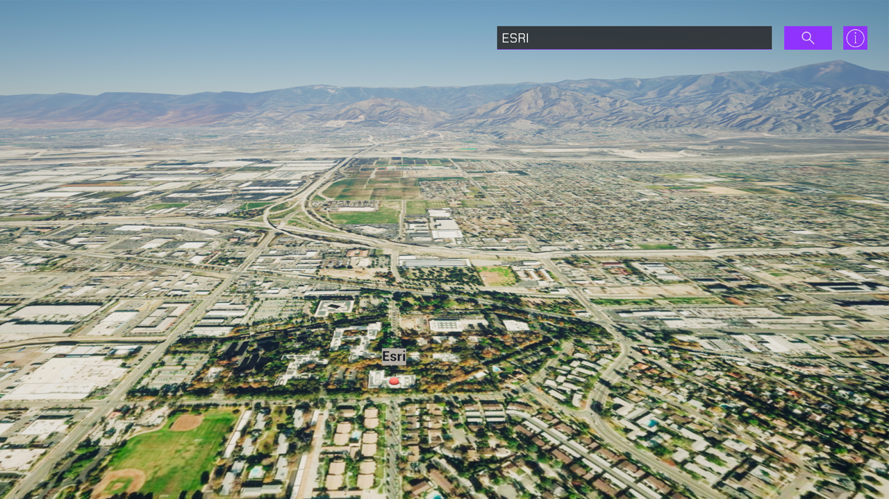

# Find places or search for an address

Find the location for an address or find the address of a selected location using the Geocoding service.

## How to use the sample

This sample demonstrates the capability of the [Geocoding service](https://developers.arcgis.com/rest/geocode/api-reference/overview-world-geocoding-service.htm) inside Unreal Engine. You can make two kinds of operations with this sample, find a place and find an address. 

1. Open the **Geocoding** level.
2. Click on the **ArcGISMap Actor** in the **Outliner**.
3. Set your API key in the **Details** panel.
4. Click play.
5. Use the search bar to find a place by name or address. For information about the type of locations that are supported by the Geocoding service, see the [ArcGIS REST APIs documentation](https://developers.arcgis.com/rest/geocode/api-reference/geocoding-find-address-candidates.htm).
6. To find a place's address, drop the marker on your point of interest by clicking in the viewport while holding Shift. The address will be displayed above the marker.

Note: This sample is only set up to work with mouse and keyboard.

## How it works

1. Have a map with the mesh colliders enabled in the level. The mesh collider is required for using raycast. 
2. Have an Actor with the C++ script to query [Geocoding service](https://developers.arcgis.com/rest/geocode/api-reference/overview-world-geocoding-service.htm).
3. The HTTPClient is used to query the Geocoding service.
4. The [`findAddressCandidates`](https://developers.arcgis.com/rest/geocode/api-reference/geocoding-find-address-candidates.htm) operation is used for finding a place.
5. The [`reverseGeocode`](https://developers.arcgis.com/rest/geocode/api-reference/geocoding-reverse-geocode.htm) operation is used for finding an address. The marker should have the [**ArcGIS Location Component**](https://developers.arcgis.com/unity/maps/location-component/) attached and its values will be used to query the address of the location.
6. Place a marker using the game engine's [raycast](https://docs.unity3d.com/ScriptReference/Physics.Raycast.html) feature to account for elevation at the queried position.

## Tags
geocoding, reverse geocoding, address, locate, search
