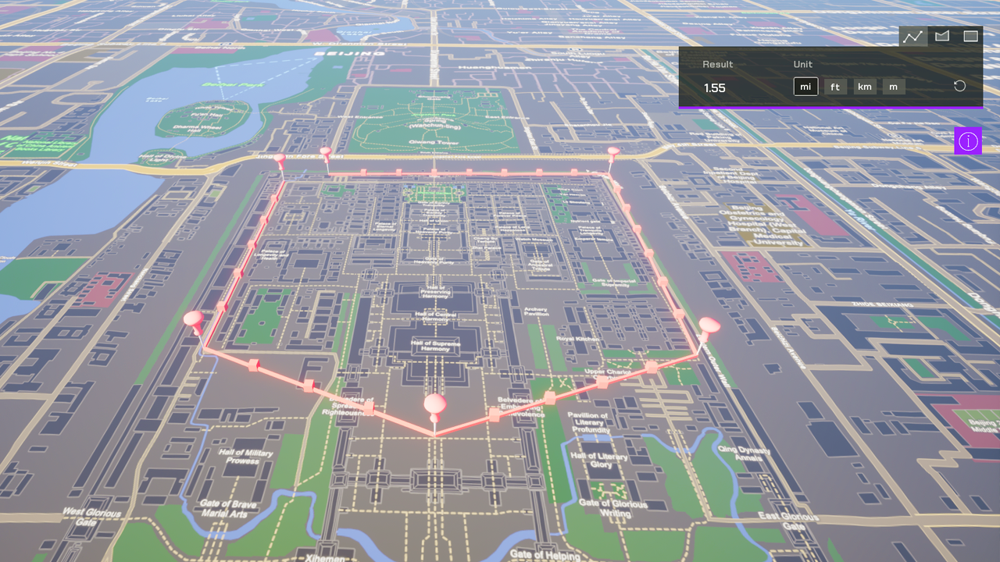

# Create polylines, polygons and envelopes (rectangles)

Draw polylines, polygons and envelopes on the map and get their lengths or areas.

## How to use the sample

1. Open the **Geometry** level.
2. Set your API Key.
3. While holding shift, click to place points to create polylines and polygons; drag to create envelopes. Switch between tabs to switch between different types of geometries.

## How it works

This sample uses the [geometry API](https://developers.arcgis.com/unreal-engine/api-reference/gameengine/geometry/arcgisgeometry/) for creating polygons, envelopes and calculate areas. It uses Unreal Engine's [USplineMeshComponent](https://dev.epicgames.com/documentation/en-us/unreal-engine/API/Runtime/Engine/Components/USplineMeshComponent) to render lines, and use the geometry API to calculate distance and areas. The distance calculated is geodetic distance, also called geodesic distance. The area calculated is geodetic area. 

Note that the polyline distance calculation accounts for elevation but is an approximation. The polygon and envelope calculation don't take elevation into account.

## Tags

measure, geometry, analysis, distance, area
