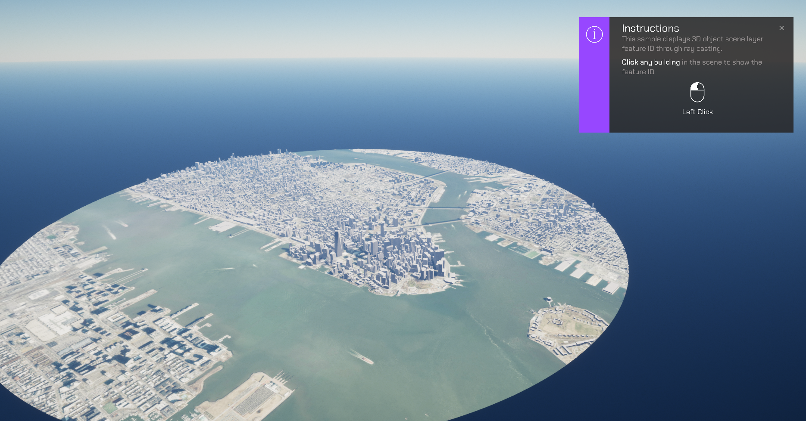
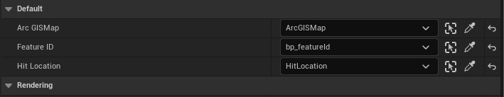

# Visualize 3DObject IDs

Get the ID for individual buildings in a Level.

## How to use the sample (SampleViewer)

1. The SampleViewer Level should open by default, if it is not open, click the **SampleViewer** Level to open it.
2. Click play.
3. Using the UI, enter an APIKey in the input field to the top left. 
4. Open the **Samples** drop down, and click **HitTest** to open the Level.
5. Click a building. The building's IDs will show up on a 3D UI Component.

## How to use the sample (HitTest Level)

1. Open the **HitTest** Level.
2. Click on the **ArcGISMap** Actor and set your API key in the **Details** panel. 
3. Click play.
4. Click a building. The building's IDs will show up on a 3D UI Component.

## How it works

1. Create an ArcGIS Map.
2. Add an **ArcGISPawn** to the Level.
3. Within the HitTest folder, drag the ArcGISRaycast Blueprint into the Level.
4. In the UI folder within the HitTest folder, drag the bp_featureId Actor into the Level.
5. Add a Sphere Static Mesh Actor into the Level and call it 'HitLocation'.
6. In the Outliner panel, select the ArcGISRaycast Actor.
7. Navigate to the Default sections in the Details Panel. For each variable shown in the image, click on the drop-down and add the respective Actor as its reference.

8. Select the **ArcGISMap** Actor in the Outliner panel, and enter your **APIKey** in the Authentication section in the Details panel.
9. Hit Play. Once the Level is running, hold Shift and click a building. The building's ID will show up in a debug on screen. 

## About the data

Building models for New York are loaded from a [3D object Level layer](https://tiles.arcgis.com/tiles/z2tnIkrLQ2BRzr6P/arcgis/rest/services/New_York_LoD2_3D_Buildings/SceneServer/layers/0) hosted by Esri.

Elevation data is loaded from the [Terrain 3D elevation layer](https://www.arcgis.com/home/item.html?id=7029fb60158543ad845c7e1527af11e4) hosted by Esri.

## Tags

raycast, visibility
