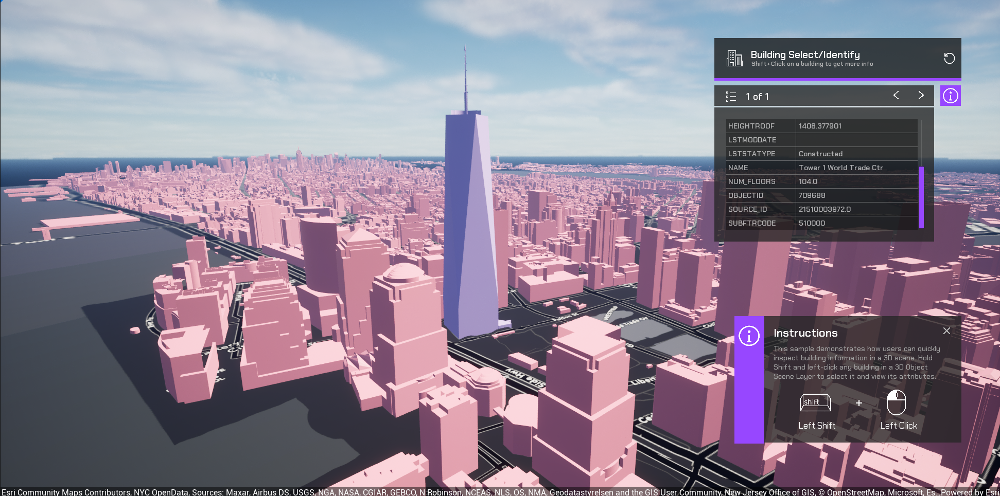

# Visualize identify results

Select buildings in a 3D Object Scene Layer, view their attributes in a table, and highlight the currently selected building in the scene.

## How to use the sample

1. Hold **Shift** and **Left-click** to select a building. The *Building Select / Identify* panel shows:
   - A paged list of all features hit by the ray.
   - A scrollable table of key–value attribute pairs for the current feature.
2. Use the **\<** and **\>** buttons to switch between features when multiple features are returned.
3. Use the menu icon to see a list of buildings. 
4. The currently selected building is highlighted in the scene.

## How it works

- The sample uses `IdentifyLayersAsync` on the `ArcGISView` to perform a **ray-based identify** between the mouse ray start and end points, obtained from `DeprojectMousePositionToWorld` and a line trace.
- For each `ArcGISGeoElement` returned:
  - Its attribute dictionary is read, converted to strings, and stored in an array of `FAttributeRow { Key, Value }`.
  - All features for the current click are stored as an array of `FFeatureAttributeSet`, enabling paging when multiple features are hit.
- The UI is a UMG widget:
  - A `ListView` uses a simple row UObject with `Key` and `Value` properties.
  - `RefreshListViewFromAttributes()` populates the list by setting those properties and adding each row as a list item.
  - Page text (e.g. `1 of 3`) is updated based on the current feature index.
- **Highlighting** workflow:
  - On startup, `SetupHighlightAttributesOnMap()`:
    - Gets the building `UArcGIS3DObjectSceneLayer` from the map.
    - Calls `SetAttributesToVisualize()` on the layer’s API object with `"OBJECTID"` so the material can access each feature’s ID.
    - Applies a material to the layer via `SetMaterialReference()`.
  - When the user changes the selected feature, `ApplySelectionToMaterial()`:
    - Extracts the current feature’s `OBJECTID` from the attribute rows.
    - Writes this value into a `UMaterialParameterCollection` scalar parameter `SelectedID`.
  - The material samples the feature attribute texture, reads the per-pixel `OBJECTID`, compares it against `SelectedID`, and renders only the matching feature with a highlight color.

## Tags

identify,  attributes, select, highlight, 3d buildings
