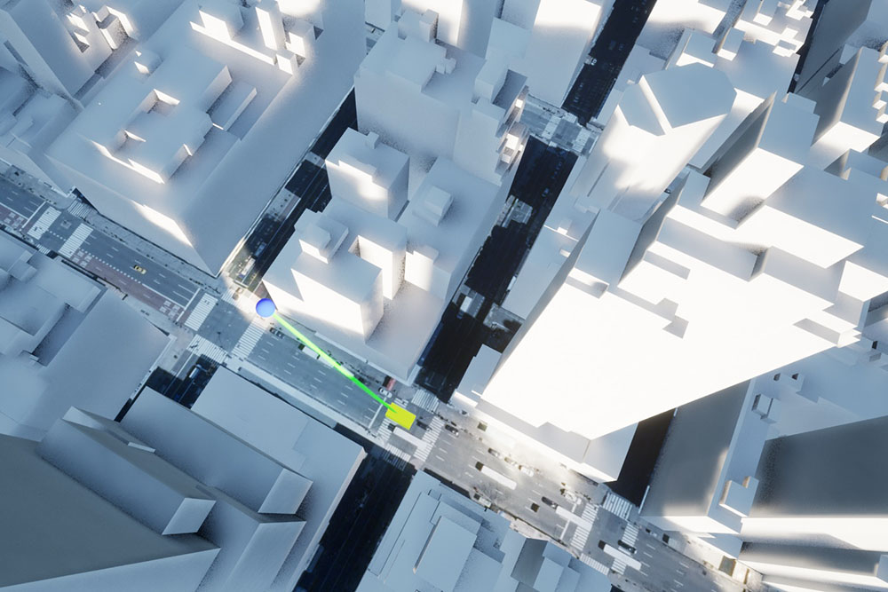

# Line of sight

Determine if the line of sight is obstructed by any object in the scene.

## How it works

1. Ensure the box for **Enable Mesh Colliders** on the `ArcGIS Map View` component of `ArcGIS Map Actor` is checked.
2. Add a `Line of Sight` and a `Way Points` actor to the scene and place them at the desired locations.
3. Modify the `Path Spline` component of the `Way Points` actor to define the path that the target object is moving along.
4. The `Line of Sight` actor looks for an instance of `Path Splnie` at `Begin Play` and performs a line trace between them at each frame. 
5. Any actors that unintentionally interfere with the trace can be added to the `Actors to Ignore` argument of the line trace in the `Line of Sight` blueprint. 
6. The visual cue for the line of sight changes its color depending on whether the line trace hits the target object or not.

## About the data

Building models for New York are loaded from a [3D object scene layer](https://tiles.arcgis.com/tiles/z2tnIkrLQ2BRzr6P/arcgis/rest/services/New_York_LoD2_3D_Buildings/SceneServer/layers/0) hosted by Esri.

WorldElevation3D/Terrain3D
Elevation data is loaded from the [Terrain 3D layer](https://elevation3d.arcgis.com/arcgis/rest/services/WorldElevation3D/Terrain3D/ImageServer) hosted by Esri.

## Tags

line of sight, raycast, visibility, visibility analysis