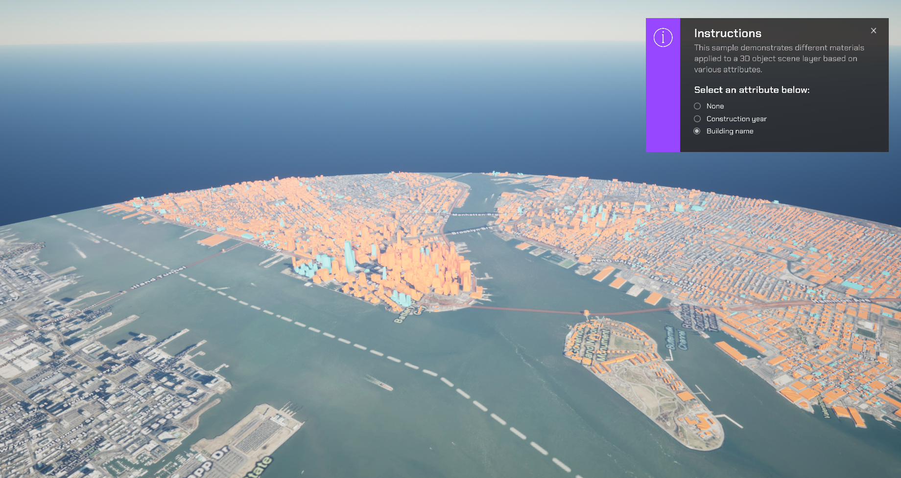

# Render a 3D object scene layer by attribute values

Apply shaders to 3D Object Scene layer based on different attributes.

## How to use the sample (SampleViewer)

1. The SampleViewer Scene should open by default, if it is not open, click the **SampleViewer** scene to open it.
2. Click play.
3. Using the UI, enter an APIKey in the input field to the top left. 
4. Open the **Samples** drop down, and click 3DAttributes to open the level.
5. Using the UI, select a filter type.

## How to use the sample (3DAttributes Scene)

1. Open the **MaterialByAttribute** Level.
2. Click on the **APIMapCreator** Actor and set your API key in the **Details** panel. 
3. Click play.
4. Using the UI, select a filter type.

## How it works

1. Create an ArcGISMap Actor.
2. Add an ArcGISPawn to the scene.
3. Drag the **APIMapCreator** Actor into the scene and select it so it is open in the details panel.
4. Attach the **SampleAttributesComponent** script to the **APIMapCreator** Actor.
5. Enter your **APIKey** in the **APIMapCreator**.
5. Select your filter type in the **AttributesComponent** and watch the materials applied to the buildings change.

## About the data

Building models for New York are loaded from a [3D object scene layer](https://tiles.arcgis.com/tiles/z2tnIkrLQ2BRzr6P/arcgis/rest/services/New_York_LoD2_3D_Buildings/SceneServer/layers/0) hosted by Esri.

Elevation data is loaded from the [Terrain 3D elevation layer](https://www.arcgis.com/home/item.html?id=7029fb60158543ad845c7e1527af11e4) hosted by Esri.

## Tags

attributes, visibility, visibility analysis
