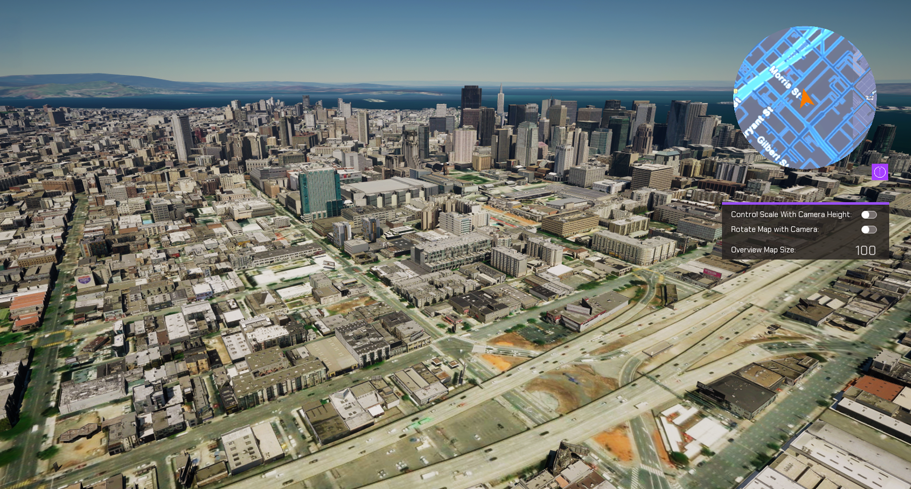

# Visualize your position in an Overview Map

## How to Setup (Overview Map Level)

1. Open the **OverviewMap_bp** or **OverviewMap_cpp** level.
2. Click on the **ArcGISMapActor** in the Outliner panel.
3. Set your API key under the Authentication section in the Details panel.
4. Click Play and select a city from the list.

## How to Setup (Sample Viewer)

1. Click Play in Unreal Editor.
2. Input your API key under the **API Key Drop-down**.
3. Click the **Sample Drop-Down** and select **Overview Map** under either the C++ or Blueprints tab.

## How it works (C++)

1. Create an ArcGIS Map using the **UI Creator**. Call it **Main ArcGISMap**. Drag in an **ArcGISPawn** into the scene and make it a child of the **Main ArcGISMap**
2. Create a second ArcGIS Map using the **UI Creator** in the same origin location as the first one. Call this one **ArcGIS Overview**
3. Drag in the **OverviewMapCamera** C++ actor. Position it below the **Main ArcGISMap** but above the **ArcGIS Overview** Map. Ensure that the **OverviewMapCamera** is a child of the **ArcGIS Overview** Map.
4. Hit play.

Note: You can use `UE_LOG` to print log messages in the **Output Log** window and see if you are gathering the data properly from the feature service.

## How it works (Blueprints)

1. Create an ArcGIS Map using the **UI Creator**. Call it **Main ArcGISMap**. Drag in an **ArcGISPawn** into the scene and make it a child of the **Main ArcGISMap**
2. Create a second ArcGIS Map using the **UI Creator** in the same origin location as the first one. Call this one **ArcGIS Overview**
3. Drag in the **bp_OverviewMapCamera** blueprint actor. Position it below the **Main ArcGISMap** but above the **ArcGIS Overview** Map. Ensure that the **OverviewMapCamera** is a child of the **ArcGIS Overview** Map.
4. Hit play.

Note: You can use `UE_LOG` to print log messages in the **Output Log** window and see if you are gathering the data properly from the feature service.

## About the data

Building models for San Francisco are loaded from a [3D object scene layer](https://tiles.arcgis.com/tiles/z2tnIkrLQ2BRzr6P/arcgis/rest/services/SanFrancisco_Bldgs/SceneServer) hosted by Esri.

Elevation data is loaded from the [Terrain 3D elevation layer](https://www.arcgis.com/home/item.html?id=7029fb60158543ad845c7e1527af11e4) hosted by Esri.

## Tags

Overview Map, 