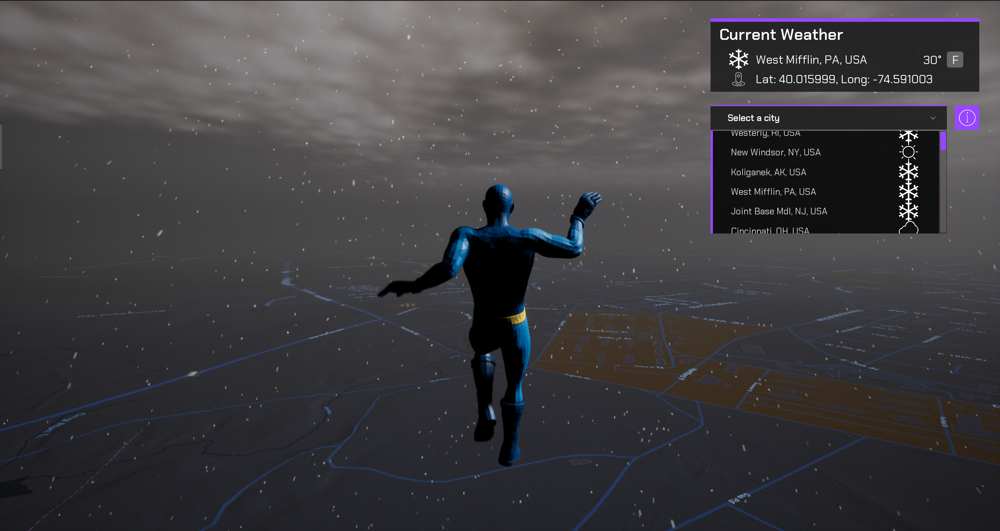

# Query a feature layer

Query objects from the feature layer provided, or provide your own, in order to show them on the map.

## How to Setup (Weather Sample Level)

1. Open the **RealTimeWeather** level.
2. Click on the **ArcGISMapActor** in the Outliner panel.
3. Set your API key under Authentication section in the Details panel.
4. Click play and select a city from the list.

## How to Setup (Sample Viewer)

1. Click Play in Unreal Editor.
2. Input your API key under the **API Key Drop down**.
3. Click the **Sample Drop Down** and select **Weather Query**.

## How it works

1. Create a new C++ class and make a http request to [query a feature layer](https://developers.arcgis.com/rest/services-reference/enterprise/query-feature-service-.htm). 
2. Create a new Blueprint Actor class
   - Create the event to place the data returned from the feature layer.
   - Create a function to spawn the actor according to the data recieved in teh query.
   - Attach the [**ArcGIS Location Component**](https://developers.arcgis.com/unreal-engine/maps/location-component/) to the static stadium mesh model.
   - Create a function to place the static mesh model on the `geometry`'s `coordinates` location returned by the feature layer query and the height calculated by [raycasts](https://docs.unrealengine.com/5.0/en-US/using-a-single-line-trace-raycast-by-channel-in-unreal-engine/).
3. Create a widget for the viewport so users can select a stadium from the list fed from the feature service.

Note: You can use `UE_LOG` to print log messages in the **Output Log** window and see if you are gathering the data properly from the feature service.

## About the data

Data for all Major League Baseball Stadiums in the United States [Feature Layer](https://www.arcgis.com/home/item.html?id=f60004d3037e42ad93cb03b9590cafec) hosted by Esri. (Format the request URL for the [query](https://services.arcgis.com/P3ePLMYs2RVChkJx/ArcGIS/rest/services/Major_League_Baseball_Stadiums/FeatureServer/0/query?f=geojson&where=1=1&outfields=TEAM,NAME,LEAGUE).)

Elevation data is loaded from the [Terrain 3D elevation layer](https://www.arcgis.com/home/item.html?id=7029fb60158543ad845c7e1527af11e4) hosted by Esri.

## Tags

Feature Layer, Data Collection