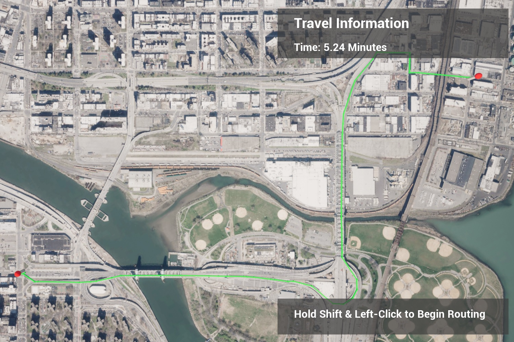

Show a route between two points on a map using Esri's routing service REST API.

## How it works

1. Set your API Key in the ArcGISMapActor using the World Outliner window (if you are using the SampleViewerLevel you can also set the key through the UI or the level blueprint).
2. While holding shift, left-click on two locations on the map. The route between the two points will be shown. 
3. This sample uses Esri's [routing service's REST API](https://developers.arcgis.com/rest/network/api-reference/overview-of-network-analysis-services.htm) to query the closest route along the road network between two points. 
4. Based on the query response, breadcrumbs are placed along the route. Raycasts are used to determine the height at each breadcrumb's position to account for elevation.
5. Spline meshes are used to visualize the route segments between pairs of breadcrumbs.
6. This sample is only set up to work with mouse and keyboard.
7. This service uses routing operations associated with your API Key. You can learn more about [API keys](https://developers.arcgis.com/documentation/mapping-apis-and-services/security/api-keys/) and [Accounts](https://developers.arcgis.com/documentation/mapping-apis-and-services/deployment/accounts/) in the _Mapping APIs and location services_ guide. [Configure your API key](https://developers.arcgis.com/documentation/mapping-apis-and-services/security/tutorials/create-and-manage-an-api-key/#set-service-scopes) to support routing capabilities. 

## Tags

routing, raycast, REST API
