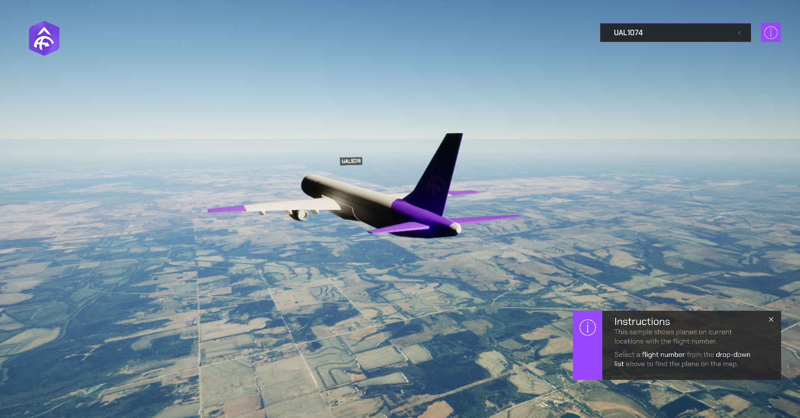

# Subscribe to a stream service

Subscribe to the stream service's WebSocket and receive information through to update information in real time.



## How to use the sample (Stream Layer Level)

This sample shows planes on current locations together with the flight number.

1. Open the **StreamLayer** level.
2. Set your API Key in the **ArcGIS Map Actor** game object using the **Details** Panel.
3. After clicking play, select a flight number from the drop-down list to find the plane on the map.

The camera moves to the plane position and you see the flight number.

## How to use the sample (Sample Viewer)

1. The **Sample Viewer** should open by default. If not, open the **Sample Viewer Level**.
2. Click play.
3. Set your API Key in the window.
4. Click the drop-down and select the Stream Layer sample from the list to open it.

## How it works

### Getting the data

This sample subscribes to a [stream service](https://enterprise.arcgis.com/en/geoevent/latest/disseminate-and-notify/stream-services.htm) on [ArcGIS GeoEvent Server](https://enterprise.arcgis.com/en/geoevent/latest/get-started/what-is-arcgis-geoevent-server.htm) using a WebSocket to receive data. 

Client applications will need to construct a subscription request that includes the WebSocket URL. The format of the request is illustrated below; make sure to include `subscribe` in the request:

```text
wss://geoeventsample1.esri.com:6143/arcgis/ws/services/FAAStream/StreamServer/subscribe
```

In this sample, the ArcGIS GeoEvent Server returns information from flights over the United States, including location and flight number, to update game objects in real-time.

The service of this sample uses mocked information so it is not accurate in real time although the workflow is the same for using a service with real-time information.

### Making the connection

To make the connection, this sample uses [`ClientWebSocket`](https://learn.microsoft.com/dotnet/api/system.net.websockets.clientwebsocket) class to connect to a WebSocket server as an asynchronous operation. It opens the connection with the WebSocket URL and processes the result while the connection remains open.

### Parsing the response

Every time the stream server has an update for a new plane or an existing one, it is necessary to parse the JSON response to update the information on the map. Apply the Unity's [`[Serializable]`](https://docs.unity3d.com/ScriptReference/Serializable.html) attribute to classes to enable serialization and parse the JSON response.

We grab the location (`x`, `y`, `z`), speed (`speed`), heading (`heading`), time the update was sent (`dateTimeStamp`), and the plane name (`name`). All of this information is used to display the plane in the correct location as well as inputs for a [dead reckoning](https://en.wikipedia.org/wiki/Dead_reckoning) system (`DeadReckoning.cs`) that updates each plane's location every frame so that the plane has a smooth animation instead of jumping from place to place every time we receive a new signal.

These new game objects are then used to populate the drop-down list, allowing you to quickly navigate to other planes by updating the `ArcGIS Camera` location. When flying around the scene, you may encounter another plane—especially if you are near a large airport.

## About the data

This sample uses the [plane location stream service](https://geoeventsample1.esri.com:6443/arcgis/rest/services/FAAStream/StreamServer) sample. This data was recorded in the past and played back in real-time. It is not a live update of the current air traffic. 

To publish your own streams of data, please refer to the [ArcGIS GeoEvent Server](https://enterprise.arcgis.com/en/geoevent/latest/get-started/what-is-arcgis-geoevent-server.htm) documentation.

## Tags

steam, stream layer, stream service, websocket, planes
