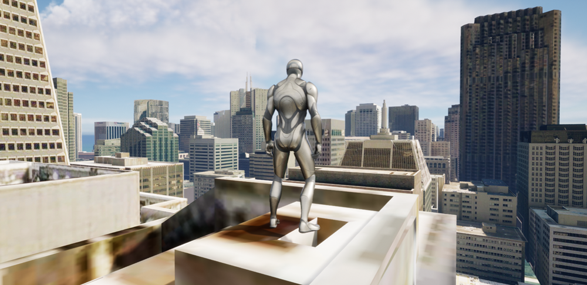

# Third Person Character Controller

Allows users to explore a city/map from the perspective of a Third Person Character.

## How it works

1. Check the box for **Mesh Colliers Enabled** on the `ArcGIS Map` component.
2. Create a parent object with an `ArcGIS Location` component.
3. Create child game objects in the scene that use `Transform` components.
4. Using the `ArcGIS Map`, change the latitude and longitude of where you would like to explore.
5. Add your third person character controller to the level and position it slightly above the ground.

## About the data

Building models for San Francisco are loaded from a [3D object scene layer](https://tiles.arcgis.com/tiles/z2tnIkrLQ2BRzr6P/arcgis/rest/services/SanFrancisco_Bldgs/SceneServer) hosted by Esri.

Elevation data is loaded from the [Terrain 3D elevation layer](https://www.arcgis.com/home/item.html?id=7029fb60158543ad845c7e1527af11e4) hosted by Esri.

## Tags

exploration, third person pespective, third person controller
