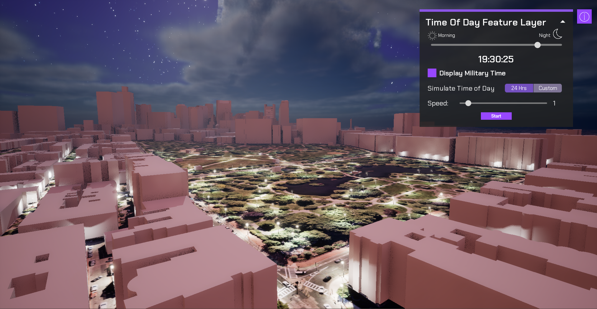

# Visualize Time of Day

Control the Time of Day manually, simulate it at a given speed, or animate it from one time to anoter.

## How to Setup (Time of Day Sample Level)

1. Open the **TimeOfDay** level.
2. Click on the **ArcGISMapActor** in the Outliner panel.
3. Set your API key under the Authentication section in the Details panel.
4. Click Play and change the time of day using the settings panel.

## How to Setup (Sample Viewer)

1. Click Play in Unreal Editor.
2. Input your API key under the **API Key Drop-down**.
3. Click the **Sample Drop-Down** and select **Time of Day**.

## How it works

1. Create a new C++ class and make an HTTP request to [query a feature layer](https://developers.arcgis.com/rest/services-reference/enterprise/query-feature-service-.htm). 
2. Create a new Blueprint Actor class
   - Create the event to place the data returned from the Feature Query.
   - Create a function to spawn the Feature actors according to the data received in the query.
   - Attach the [**ArcGIS Location Component**](https://developers.arcgis.com/unreal-engine/maps/location-component/) to the Feature actor blueprint class.
   - Add point lights to the feature items and set them to **off** by default.
3. Create a blueprint actor and add the following components to it:
   - Directional Light for the sun
   - Directional Light for the moon
   - Exponential Height Fog
   - Sky atmosphere
   - Volumetric Clouds
4. Create a custom material for the sky atmosphere to show the stars at night and the sky during the day.
5. Calculate the time of day based on the rotation of the Sun/Moon in the scene.
6. Create a widget for the viewport so users can cotrol the time using a slider or set animation properties.
7. Set a time for the Point Lights to turn on and to turn off.

Note: You can use `UE_LOG` to print log messages in the **Output Log** window and see if you are gathering the data properly from the feature service.

## About the data

Data for Boston Lamp Posts is fetched from a [Feature Layer](https://services.arcgis.com/V6ZHFr6zdgNZuVG0/ArcGIS/rest/services/Boston_Street_Light_Locations/FeatureServer/0/query?f=geojson&where=1=1&outfields=*)hosted by Esri.
Elevation data is loaded from the [Terrain 3D elevation layer](https://www.arcgis.com/home/item.html?id=7029fb60158543ad845c7e1527af11e4) hosted by Esri.

## Tags

Feature Layer, Data Collection, Time of Day