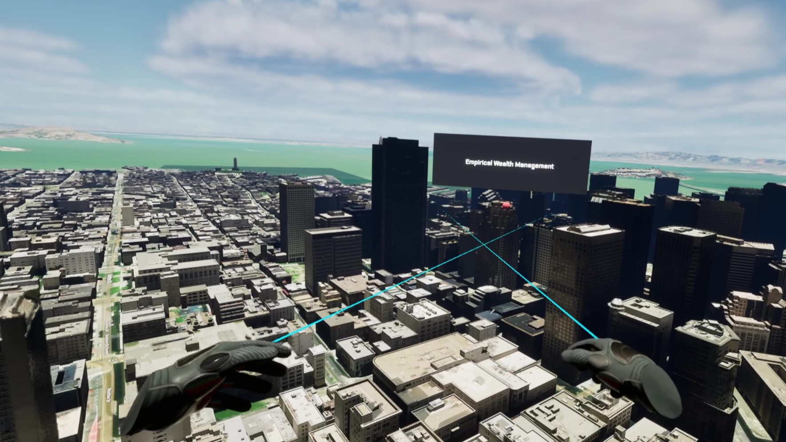

# Explore the world in virtual reality

Allows users to explore a city/map from the first-person perspective using Virtual Reality.

## How to use the sample

1. Prior to opening the project, ensure your VR headset is connected and any required software is running (SteamVR, Oculus, Vive Streaming Hub).
2. Open the **VRSample_lvl** level.
3. Click on the **ArcGISMapActor** in the Outliner panel.
4. Set your API key under the **Authentication** section in the Details panel.
5. If the play mode is not set to **VR Preview**, click on the 3 dots and select **VR Preview**, otherwise just hit play.

## How it works

1. Set up **ArcGIS Map** for the exploration area.
2. Create a Virtual Reality Character or use the one we provide.
3. Create a blueprint called **Follow Camera** and open it.
4. Add an **ArcGISCamera** and an **ArcGISLocation Component** to the blueprint. 
5. Using the blueprints Tick Function, create a function that allows the **Follow Camera Blueprint** to follow the Virtual Reality Character. This is used for rendering the **ArcGISMap Component** and any layers you may have added.  
3. Add the Virtual Reality Character to the level.
   - Mesh colliders need to be enabled in the **ArcGIS Map Component**.
   - If you want to place the character in a specific location, use the [**ArcGIS Location Component**](https://developers.arcgis.com/unreal-engine/maps/location-component/) to specify its location.
   - Adjust the `Z` Location value of the character to be above the location you would like it at.

## About the data

Building models for San Francisco are loaded from a [3D object scene layer](https://tiles.arcgis.com/tiles/z2tnIkrLQ2BRzr6P/arcgis/rest/services/SanFrancisco_Bldgs/SceneServer) hosted by Esri.

Integrated mesh layer for Girona, Spain is loaded from [Integrated Mesh Layer](https://tiles.arcgis.com/tiles/z2tnIkrLQ2BRzr6P/arcgis/rest/services/Girona_Spain/SceneServer) hosted by Esri.

Building model for Christchurch, New Zealand is loaded from a [Building Scene Layer](https://tiles.arcgis.com/tiles/pmcEyn9tLWCoX7Dm/arcgis/rest/services/cclibrary1_wgs84/SceneServer) hosted by Esri.

Building models for New York are loaded from a [3D object scene layer](https://tiles.arcgis.com/tiles/P3ePLMYs2RVChkJx/arcgis/rest/services/Buildings_NewYork_17/SceneServer) hosted by Esri.

Elevation data is loaded from the [Terrain 3D elevation layer](https://www.arcgis.com/home/item.html?id=7029fb60158543ad845c7e1527af11e4) hosted by Esri.

## Tags

exploration, third person perspective, third person controller
