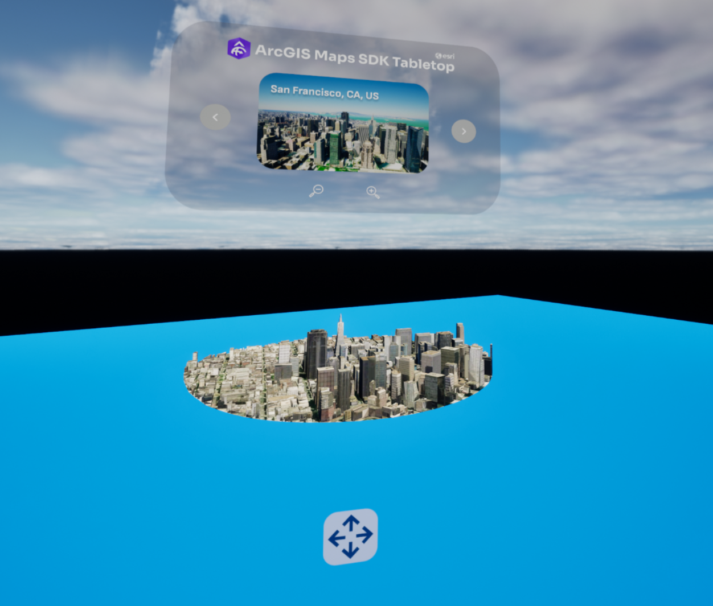

# Explore the world in tabletop XR

Allows users to view the world using a tabletop map and explore different landmarks.

## How to use the sample

1. Prior to opening the project, ensure your VR headset is connected and any required software is running (SteamVR, Oculus, Vive Streaming Hub).
2. Open the **XRTabletop** level.
3. Click on the **ArcGISMapActor** in the Outliner panel.
4. Set your API key under the **Authentication** section in the Details panel.
5. If the play mode is not set to **VR Preview**, click on the 3 dots beside the play button and select **VR Preview**, otherwise just hit play.

## How it works

1. Use the **XRTabletopComponent**, attached to the **ArcGIS Map** actor for setting up the Tabletop.
2. **bp_XRTableTopInteractorPawn** is used to pan and zoom the map and to move the entire map to a different location. 
3. Use the **bp_LoadData** to specify different landmark locations and the corresponding configurations for extent size and elevation offset. 
4. Using the interface **wbp_TableTopUI**, user can switch between the preset locations.

## About the data

Building models for San Francisco are loaded from a [3D object scene layer](https://tiles.arcgis.com/tiles/z2tnIkrLQ2BRzr6P/arcgis/rest/services/SanFrancisco_Bldgs/SceneServer) hosted by Esri.

Integrated mesh layer for Girona, Spain is loaded from [Integrated Mesh Layer](https://tiles.arcgis.com/tiles/z2tnIkrLQ2BRzr6P/arcgis/rest/services/Girona_Spain/SceneServer) hosted by Esri.

Building model for Christchurch, New Zealand is loaded from a [Building Scene Layer](https://tiles.arcgis.com/tiles/pmcEyn9tLWCoX7Dm/arcgis/rest/services/cclibrary1_wgs84/SceneServer) hosted by Esri.

Building models for New York are loaded from a [3D object scene layer](https://tiles.arcgis.com/tiles/P3ePLMYs2RVChkJx/arcgis/rest/services/Buildings_NewYork_17/SceneServer) hosted by Esri.

Elevation data is loaded from the [Terrain 3D elevation layer](https://www.arcgis.com/home/item.html?id=7029fb60158543ad845c7e1527af11e4) hosted by Esri.

## Tags

exploration, tabletop map, virtual reality, extended reality

